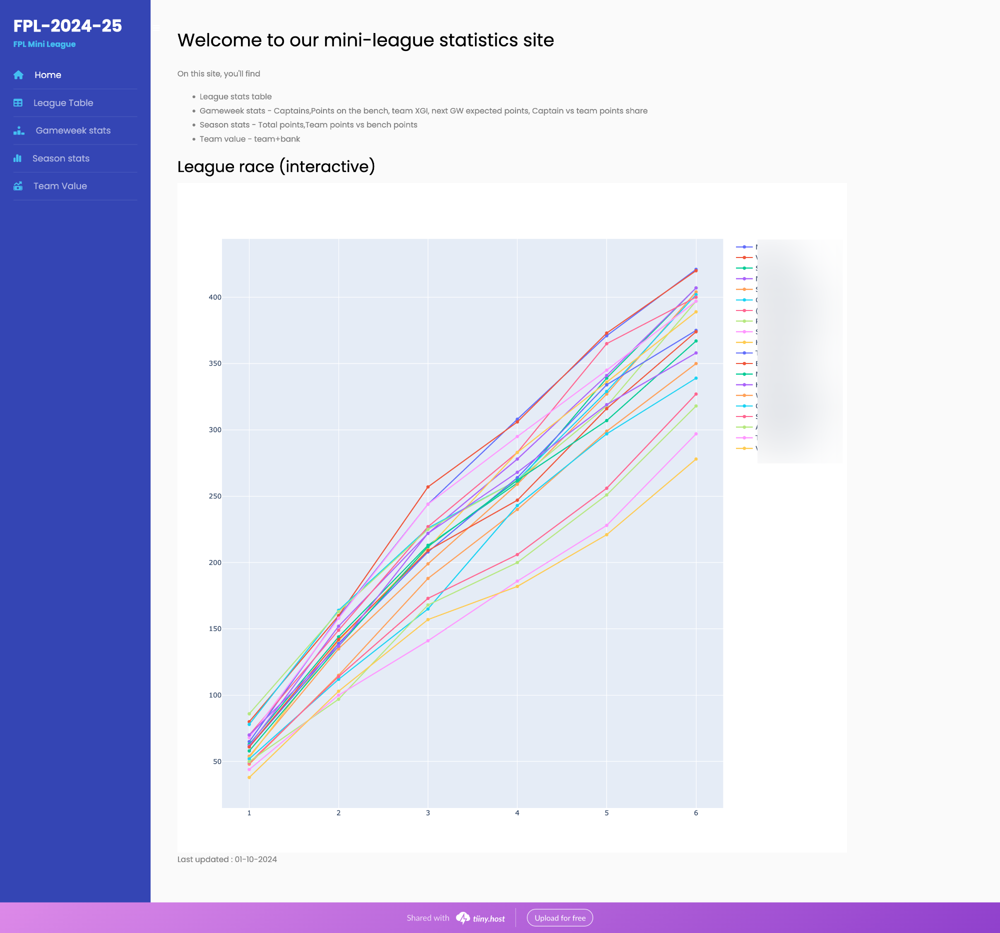
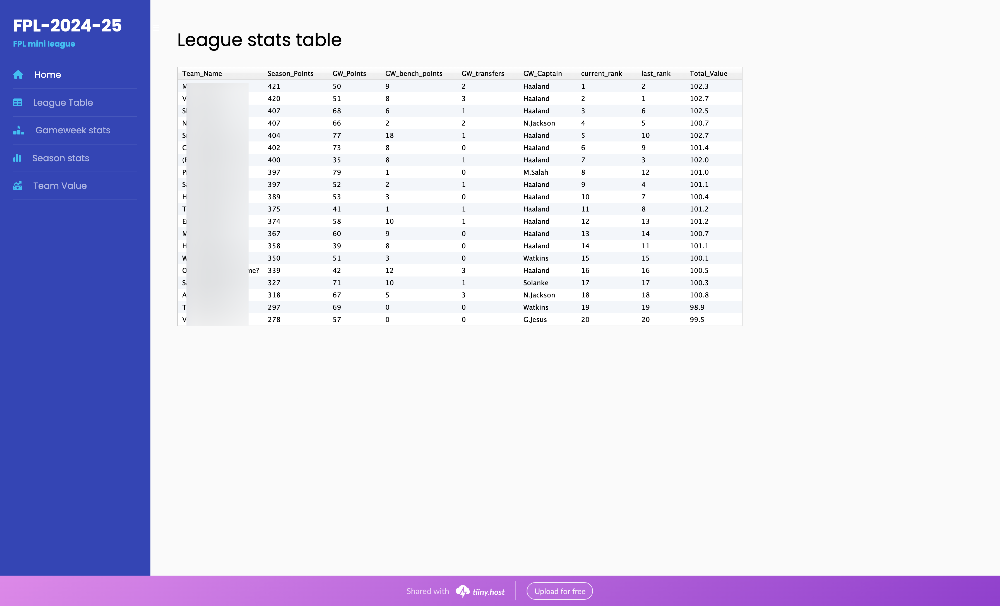
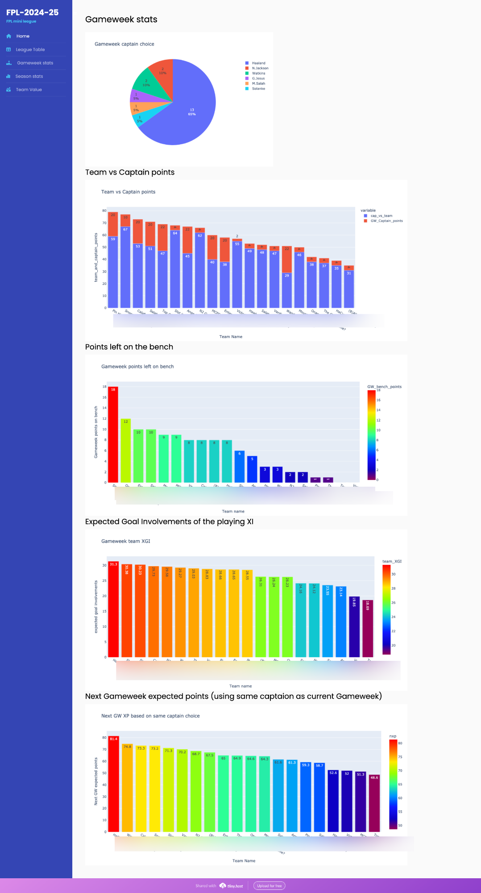
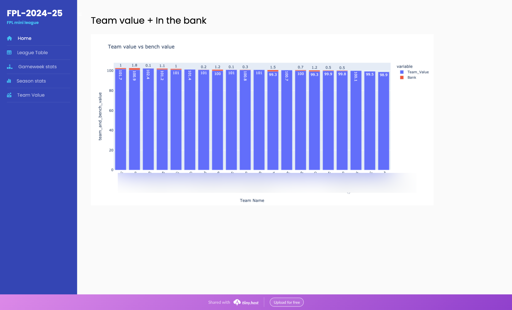

# fpl-mini-league
This repository hosts the code for FPL mini-league statistics website. 
Running the main program (mini-league.py) will do the following:
* Scrape the official FPL API for
    * Mini-league statistics
    * Use gameweek history
    * Player data

* Analyse and Create required graphs and charts
* Create a static (html+css) website with all the analysed data, which can be accessed using [index.html](web/index.html) 

## What data/stats are available ? 
* Mini-League table
    * Team_Name,Season Points,GW Points,GW bench points,GW transfers,GW_Captain,current league rank,last league rank,Total team Value
* League Race (line-chart)
* Captain choice of the league (pie-chart)
* Season points Total (bar-chart)
* Season points+ points on bench (stacked bar-chart)
* Gameweek points on bench (bar-chart)
* Gameweek points+bench points (stacked bar-chart)
* Team value + In the bank (stacked bar-chart)


## How-to run this repo
1. Clone the repo
2. install the requirements
    ``` bash
    pip install -r requirements.py 
    ```
3. Run the program
    ``` bash
    python mini-league.py
    ```
4. It will ask for the League ID 
5. Enter the league ID and hit enter
6. Wait for programe to finish
7. You mini-league website is ready under web folder

## Hosting your site
* compress (zip) the web directory after running the program
* head to https://tiiny.host/
* Register and upload the ZIP file
* your free site is ready!

## Screenshots
#### Home page

#### League table

#### Gameweek stats

#### Team value


## Technologies used
* Python
* Pandas
* plotly
* jinja2

### Website template
- Simply Amazed HTML Template by Tooplate